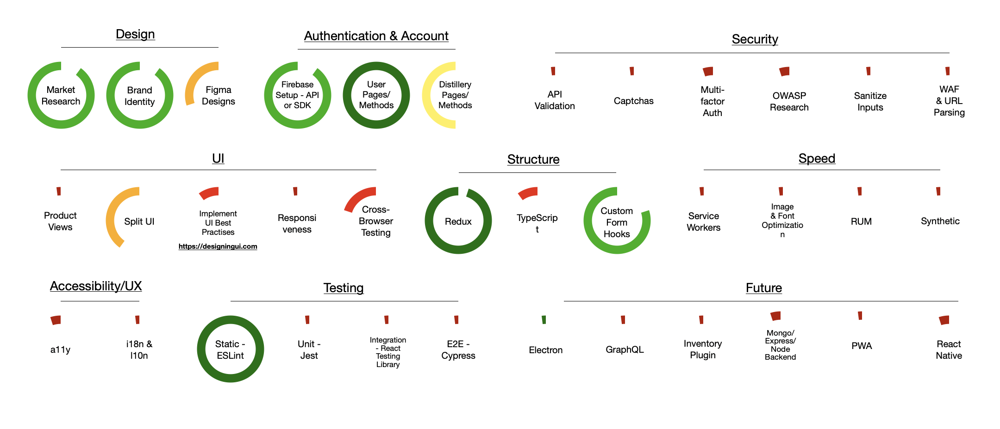
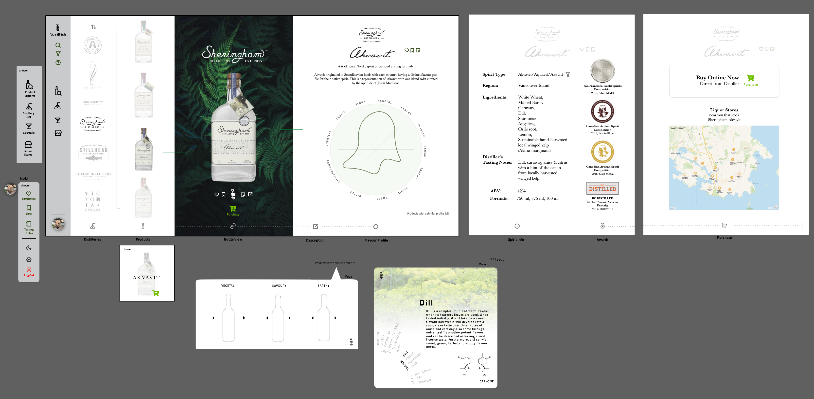
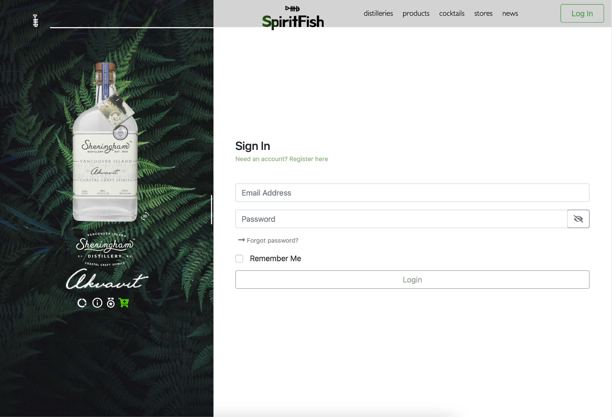

___

A directory of local distilleries and spirits, with locally curated cocktails, tasting note submission, and 
eventually a spirit-product-focussed retail inventory plug-in. The main selling point will be the clear, attractive, 
and tailored, presentation of products and their details.

The main objective is to increase success and sales of local small business and the hospitality industry.

## Overview
The website has three main parts: the public directory, a user area for submission of tasting notes and saving 
wish/tasting lists, and a simple CMS for distilleries to add and edit their products. Currently, the project uses React and 
Redux, 
with 
Firebase as a backend. I aim to use Jest and Cypress for Integration and E2E testing, with the help of RTL.

## Goals
This is my first React project as a self-taught developer, after taking a course in 2020. I have many goals for the
final build, which are outlined in the chart below, and further detailed in the sections following.

## 1.0 Design
### 1.1 Brand Identity/Market Research

There is a gap in the market when it comes to online liquor ordering and inventory systems. There are options out 
there for general product sales, which some distilleries currently use, but none specifically for liquor products 
and all their properties. BC liquor laws are slowly becoming more lenient, and eventually there may be options for 
online private liquor stores, which would be a large target market.

90% of the distilleries in BC utilize Canadian and "West Coast" imagery in their branding. I wanted to integrate 
this into the project's identity to draw in potential users. This is incorporated into the brand name,
colour palette, and background images of the project. 

### 1.2 Figma Designs

Currently in progress, links to responsive prototypes will be posted here as they are completed.

## 2.0 Authentication
### 2.1 Authentication

For speed of development, the project will use Firebase as a back-end. The project will eventually use 
Mongo/Express/Node. Authentication is therefore managed by Firebase's Auth SDK. One problem with 
Firebase is the lack of in-depth support for user roles. The project requires a "Patron" role - the main users of 
the website, and a "Distiller" role - the creators of content for the Patrons. In order to differentiate the two, 
the Distiller authentication  pathway performs an extra database query against a list of invited email addresses.

I aim to take advantage of Firebase's OAuth integrations, and also incorporate multi-factor authentication methods, such as SMS 2FA.

## 3.0 User Interface

I aim to implement many of the best practises found in "Designing User Interfaces" by Michał Malewicz and Diana 
Malewicz, which is the most comprehensive resource I have found thus far for front-end design.

### 3.1 Product Explorer View

The Product Explorer is the main selling point of the project. 

Once the user enters the Product Explorer, the entire flow becomes 
horizontal, and can be traversed by the icon "timeline" running along the footer of the page. The right-hand side of 
the screen becomes a horizontally scrolling window in order to present three views with all the information about each 
product:
    
- **Flavour Wheel** - The flavour wheel is a tool for selecting other products the user might like, along with learning about flavour 
compounds along the way.
- **Information & Awards**: A list of fields, which are searchable and link to other areas of the website. E.g. clicking on Spirit Type - Gin would present you with similar gins, or one of the flavours in the flavour profile presents you with other spirits containing that flavour.
- **Purchase**: Links to purchase the product from the distiller, and also links to liquor stores stocking the product, with a map (the user enters their postcode on registration).

Distillers have the option to swap out fonts, backgrounds and colour schemes to match each product. 

### 3.2 Split UI

On pages that aren't associated with the Product Explorer, the UI is split, providing a small, resizeable product view carousel, with brief information about a selection of featured products. The right-hand side of the screen provides the main functionality of the website.

### 3.3 Cross-Browser & Responsiveness Testing

Using the tools at Google Analytics, netmarketshare.com, statcounter.com and browserling.com or possibly crossbrowsertesting.com, SpiritFish will be tested for cross-browser compatibility and responsiveness.

## 4.0 Structure
### 4.1 Typescript
The project was recently migrated to TypeScript. There are still many "any" types, however I aim to enable noImplicitAny and strictNullChecks once all types have been defined.

### 4.2 Custom Hooks
I have created a set of custom React hooks in order to render forms, validate inputs and display errors. A JS object is created as a setup for the form, which the hook takes as a prop. I hope to continue developing this as a reusable component across my projects.

## 5.0 a11y, i18n & l10n
### 5.1 a11y
Continue checking against [A11y Project Checklist](https://www.a11yproject.com/checklist/)

### 5.2 i18n & l10n
Look into [React-i18next](https://react.i18next.com) and [React-intl](https://formatjs.io/docs/react-intl/components/)

## 6.0 Testing
Jest & RTL:

[Jest DOM Testing Docs](https://jestjs.io/docs/en/tutorial-react#dom-testing)

[Guide to Testing React Apps](https://thomlom.dev/beginner-guide-testing-react-apps/)

\
Cypress:

[Cypress Docs: Writing Tests](https://docs.cypress.io/guides/core-concepts/writing-and-organizing-tests.html#Writing-tests)

[Cypress Docs Typescript Support](https://docs.cypress.io/guides/tooling/typescript-support.html#Types-for-plugins)

[Webstorm Plugin](https://plugins.jetbrains.com/plugin/13819-cypress-support)

## 7.0 Security
API validation, Captchas, Input sanitization, WAF & URL parsing. Research:
[OWASP Web Security Testing Guide](https://owasp.org/www-project-web-security-testing-guide/)

## 8.0 Speed
[Smashing Magazine Front End Performance Checklist 2021](https://www.smashingmagazine.com/2021/01/front-end-performance-2021-free-pdf-checklist/)

## 9.0 Future Directions
Research:

[Storybook.js](https://www.learnstorybook.com)

[Styled Components](https://styled-components.com)

[PWA - Workbox](https://developers.google.com/web/tools/workbox/modules/workbox-webpack-plugin)

### 9.1 E-Commerce Plug-in
I would like to turn the Product Explorer section of the project into an e-commerce plug-in/add-on, with a simple inventory tracking module, targeted towards online liquor retailers. 

